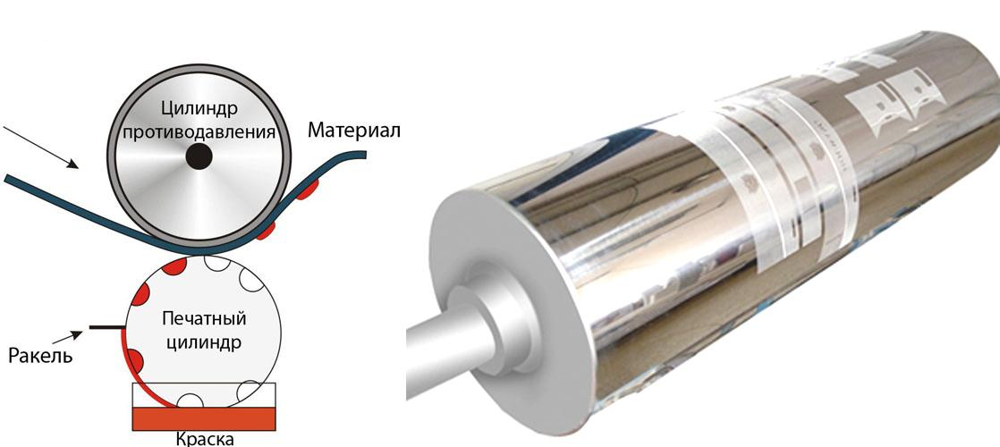
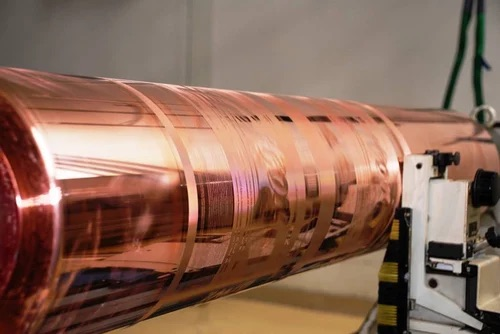
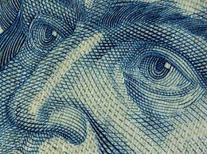

# Глубокая печать

Если есть высокая печать, то наверное должна существовать и низкая печать, подумаете вы… И будете правы. Только для благозвучия этот вид печати называется не низким, а глубоким. При глубокой печати, как подсказывает логика, печатный элемент формы ниже пробельного. И если при высокой печати форму достаточно смазать краской, пробельные элементы хоть и тоже заполнятся краской, но за счет перепада высот не коснутся бумаги, то в случае глубокой печати, краска заполняет канавки на форме, а с пробельных элементов излишки убираются дополнительным приспособлением. Это может быть ракель или щетки.

<figure><figcaption></figcaption></figure>

История возникновения глубокой печати начинается примерно во второй половине XV века, когда гравюра на металле — офорт — начала вытеснять ксилографию на дереве. На пластине из металла (медь, бронза, цинк, сталь) гравировали или вытравливали кислотой рисунок, затем покрывали краской. Краску очень аккуратно стирали так, чтобы на печатной форме осталась лишь краска в выгравированных углублениях. Пластина под давлением цилиндрического пресса прижималась к бумаге. Данный метод очень сильно отличался от наборной печати, поэтому листы с иллюстрациями печатали отдельно от листов с текстом.

<figure><figcaption>
W. M. Cary — Shooting the rapids — офорт
</figcaption></figure>

Часто глубокую печать называют интаглио (интальо). Если печать осуществляется на рулонном носителе, то такую печать так-же называют ротогравюрой.

Глубокая печать — процесс элитный, дорогой. И связано это со стоимостью самой печатной формы. Это металлические валы с гравировкой. Сейчас валы гравируются лазером или станками с ЧПУ, а раньше их гравировали мастера вручную. Они очень износостойкие.

<figure><figcaption>
Электронная гравировка формы для глубокой печати
</figcaption></figure>

Глубокую печать нет смысла заказывать там, где нужно отпечатать тысячу или десять тысяч изделий. В мире глубокой печати властвуют миллионные тиражи. В советское время на ротогравюрных станках печатались многомилионные журналы «Здоровье», «Огонёк», «Работница»… На таких станках печатают пачки для сигарет. На таких станках печатают деньги и другие ценные бумаги.

<figure><figcaption></figcaption></figure>

Кроме того, технология глубокой печати обеспечивает высочайшее качество оттиска и позволяет добиться интересных эффектов, таких как ирисовая печать (плавный переход одного цвета в другой без использования растра), рельефная печать (скребли ногтиком портреты на долларах?), орловская печать, а за счет разной глубины печатных элементов можно печатать разные оттенки цвета без использования растра (про растр мы поговорим позднее).

К сожалению, отдельные технологии глубокой печати не доступны простым смертным, так как станки позволяющие печатать ирисовые переходы, орловскую печать и различные защитные печати, поставляются исключительно в государственные монетные дворы и частные типографии без лицензии государства приобрести такие станки не смогут.

Но сама глубокая печать в Украине доступна. Если тиражи огромные, требование к качеству высокое, а бюджет позволяет, то почему нет?
