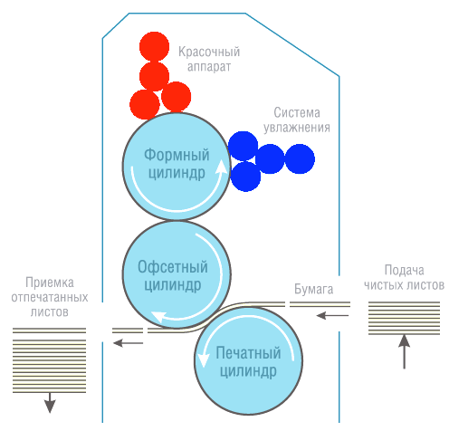
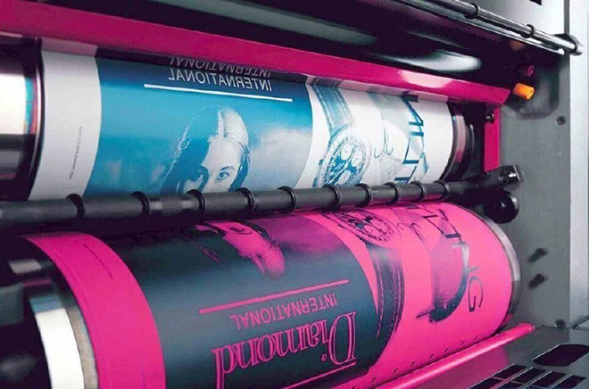

# Офсетная печать

Итак. Мы с вами разобрали высокую и глубокую виды печати. Так может есть и плоская печать? Отвечаю. Есть. Но тут следует отличать плоский вид печати и плоскопечатный станок. Ага! Разные вещи. Сейчас поясню.

> Станки многих видов печати могут быть плоскопечатными и ротационными. Если печатная машина имеет плоскую печатную форму (вне зависимости от вида печати), то она называется плоскопечатной. А если печатная форма выполнена в виде цилинда, то машина с такой формой называется ротационной.

> А вот _вид печати_, в котором печатный и пробельный элементы выполнены на одном уровне, называется плоским.

> Кроме того, станки могут отличаться по виду подачи материала на листовые и рулонные.

И поэтому могут возникать курьёзные сочетания, вроде как машина плоскопечатная, но при этом — высокой печати.

С прелюдией закончили, переходим непосредственно к офсетной печати.

Офсет — это наверное самая распространенная разновидность печати. Офсетом печатают подавляющее большинство книг, журналов, газет, различной рекламной макулатуры… При тираже от 100 листов (не путать с изделиями, которых на листе может быть много) офсетная печать становится одной из самых дешевых видов печати. При этом обеспечивает высокое качество. В голове большинства, хоть немного связанных с заказом печатной продукции, офсет это и есть полиграфия. А устроено всё и просто и сложно одновременно.

Если форма плоская, то каким образом происходит отделение печатных элементов от пробельных? Для этого нужно понимать, как устроена офсетная форма. Это тонкий алюминиевый лист, на который на фабрике нанесен слой светочувствительного полимера. После того, как на форму проэкспонировали изображение и протравили химикатами, те области, которые подверглись действию света, стали гидрофильными. Это значит, они притягивают воду. Те же области, которые остались в темноте, были смыты проявочным раствором, обнажив слой, который воду отталкивает, но притягивает масло. Перед тем, как наносить краску, форму смачивают водой. После к ней прикатывается краска. Краска по составу маслянная (не как у художников, просто по составу она такая). Соответственно краска прилипла к форме только в тех местах, где форма была не смочена водой, а именно в области печатных элементов.

Но форма сама по себе достаточно нежная, поэтому нужно исключить прямой контакт формы с жесткой бумагой. И тогда в действие вступает офсетный цилиндр. Он покрыт мягким каучуком и не вредит печатной форме. А затем уже офсетный цилиндр переносит налипшую на него краску на бумагу или другой носитель.

<figure><figcaption>
Одна из схем расположения деталей в офсетной печатной машине, вид сбоку
</figcaption></figure>

<figure><figcaption>
Хорошо видно формный (сверху) и офсетный (снизу, красный) цилиндры
</figcaption></figure>

Именно благодаря слову offset, что в контекстном переводе обозначает перенос, печать и получила название офсетной.

Итог. Офсетная печать на текущий момент — самый распространенный вид печати. И самый доступный из мира промышленной полиграфии.
