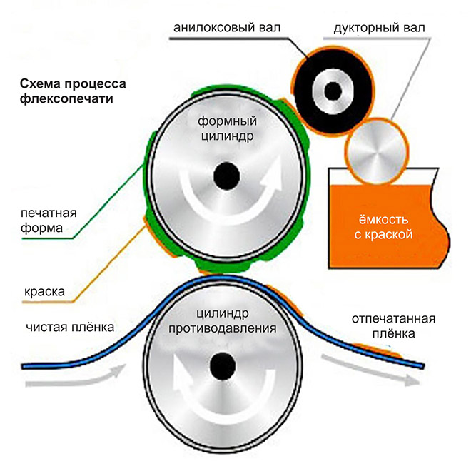
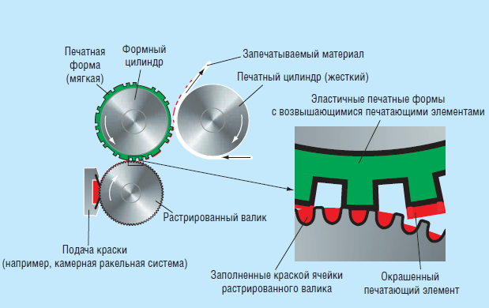
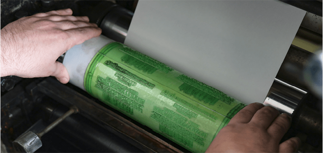
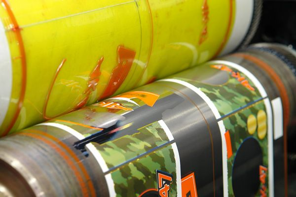
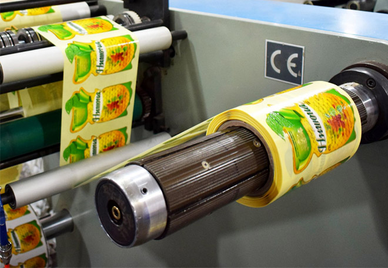

# Флексографская печать

Как только у человечества появилась необходимость печатать на плёнках, сразу люди попытались приспособить уже имеющиеся технологии. И первой под руку попалась древнейшая, высокая печать. И с небольшими изменениями приспособили ротационную рулонную машину высокой печати. Заправили в неё гибкие, практически резиновые формы, изменили способ подачи краски и назвали такой вид печати флексографским.

Вот честно. Я, не смотря на свои образование, опыт и поездки на печать, до сих пор не могу понять, зачем выводить этот способ печати в отдельный вид… С моей точки зрения, это подвид высокой печати. Но… Раз это деление есть, будем пользоваться международной терминологией.

Итак. Подавляющее число этикеток на плёнках — это флекс. Подавляющее количество пакетов — флекс. Подавляющее количество этикетки, которая поставляется в рулонах — это флекс, практически вся мягкая упаковка (например пакеты с молоком) — ну вы поняли!

Флексографские станки представляют собой всегда рулонные и всегда ротационные печатные станки. Печатные формы уже давно не резиновые, а фотополимерные, но они — гибкие. Видимо поэтому печать называется флексографской, от латинского слова _flexus (изогнутый)_. Форма либо купается в ванночке с краской (для простых работ) либо в ванне с краской вращается так называемый растровый вал, поверхность которого представляет из себя сотовую структуру. В ячейки растрового вала набирается краска, которая потом переносится на форму. А уже с формы переносится на носитель.

<figure><figcaption>
Принципиальные схемы флексографских печатных станков
</figcaption></figure>

<figure><figcaption>
Принципиальные схемы флексографских печатных станков
</figcaption></figure>

<figure><figcaption>
Мастер устанавливает печатную форму в станок
</figcaption></figure>

<figure><figcaption></figcaption></figure>

Кстати, совершенно необязательно такую печать использовать только для запечатывания плёнок. Это может быть и, например, рулонная самоклеящаяся бумага из которой в конце печатной машины будет высекаться этикетка.

<figure><figcaption></figcaption></figure>
