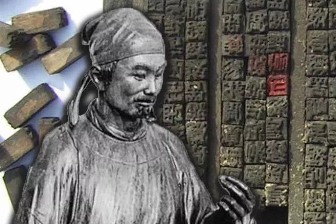
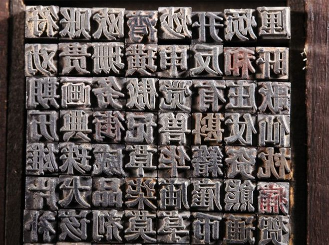
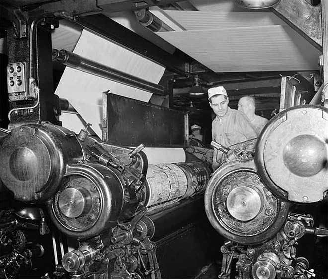
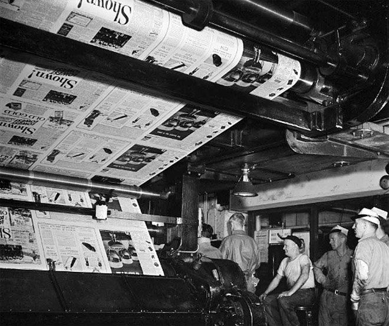
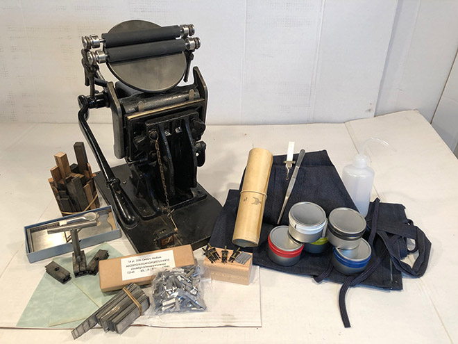
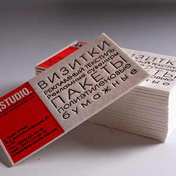
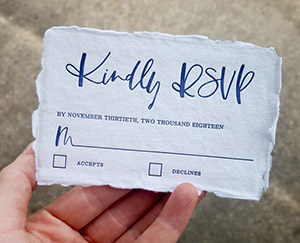

# Высокая печать

Самым древним способом нанести краску на поверхность является… кисточка. Но вот с повторяемостью — беда. Древний Китай был гигантской империей, а приказы императора нужно было в точности передать в огромное количество провинций, городов и сел. Писари совершали ошибки, переписывая приказы кисточкой. Поэтому где-то в XI веке некто Би Шень придумал вырезть иероглифы на деревянных кубиках (теперь мы называем это наборной кассой шрифтов, а в собранном виде — клише или печатной формой), смазывать их тушью и ставить оттиски на бумаге. Так древний Китай считается родиной первого вида печати. Высокой печати. Высокой потому, что если смотреть на клише сбоку, краска содержится на высоких частях клише, а канавки (глубокие части клише) краску на бумагу не переносят.

<figure><figcaption>
Би Шень, изобретатель высокой печати
</figcaption></figure>

<figure><figcaption>
Би Шень, изобретатель высокой печати
</figcaption></figure>

Постепенно я буду посвящать вас в терминологию.

* Та часть клише или формы (это синонимы), которая переносит краску на бумагу, называется _печатным элементом_.
* Та часть формы, которая не должна перенести краску на бумагу, называется _пробельным элементом_.
* печать называется _высокой_, если у печатной формы мечатный элемент выше пробельного.

Сложно? Давайте проще. Все видели, как устроена обычная канцелярская печать? В бухгалтерии или у директора? Ну резиновая такая, которую нужно вначале на чернильную подушечку поместить, а потом на документ поставить… Вот это и есть самый распространенный вид высокой печати.

В начале XX века станки высокой печати использовались не только в типографиях, но и в корпорациях. Были даже настольные станочки с площадью печати не превышающей по размеру конверта. На них в офисах печатали визитные карточки, пропечатывали обратные адреса на корреспонденции, готовили поздравительные открытки и многое другое. Ещё в 70-х годах высокая печать лидировала в книгопечатании и даже в газетно-журнальном производстве. Но сегодня, вид печати, она уже отдала корону другим видам печати. Но сама технология ещё жива и используется во вспомогалельных процессах, таких как тиснение, но об отделочных процессах я расскажу позже.

<figure><figcaption>
Начинают работать печатные станки (в английской газете The Times подобные печатные станки работают со скоростью 40 000 экземпляров 32-страничной газеты в час)
</figcaption></figure>

<figure><figcaption>
Как только с конвейера сходят первые экземпляры, печатник проверяет их на наличие дефектов печати
</figcaption></figure>

<figure><figcaption>
Настольный станочек высокой печати фирмы Sigwalt с размером печатной области 3х5 дюймов
</figcaption></figure>

Подведём итоги. Высокая печать — древнейший вид печати. В настоящее время практически не используется, за редкими исключениями. Я знаю, например, несколько типографий в Киеве, в которых на малых станках на дизайнерских пухлых картонах (иногда с необрезанными краями, что добавляет шика) печатают дизайнерские визитки и открытки. Но это большая редкость сегодня и я описание этого вида печати привёл для общего образования и понимания базовых вещей.

<figure><figcaption>
Визитки на пухлом картоне
</figcaption></figure>

<figure><figcaption>
Карточка на самодельном картоне с необрезанными краями
</figcaption></figure>
